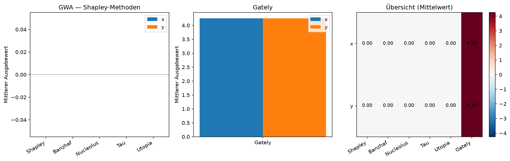
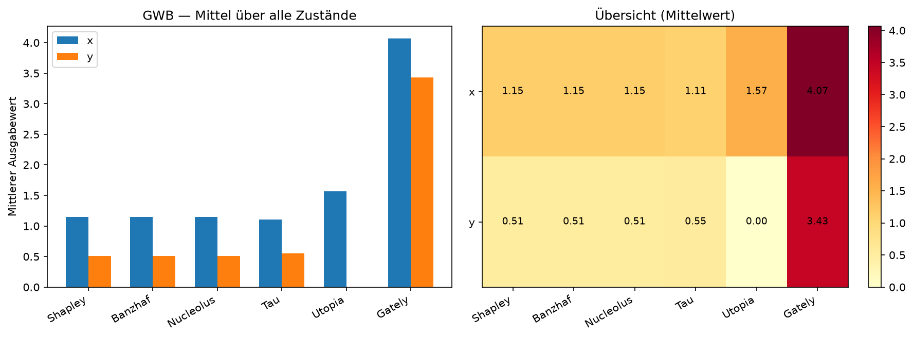
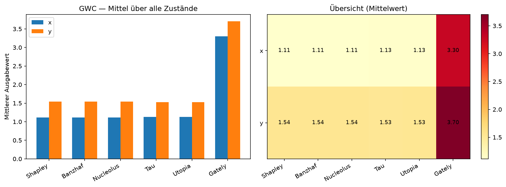
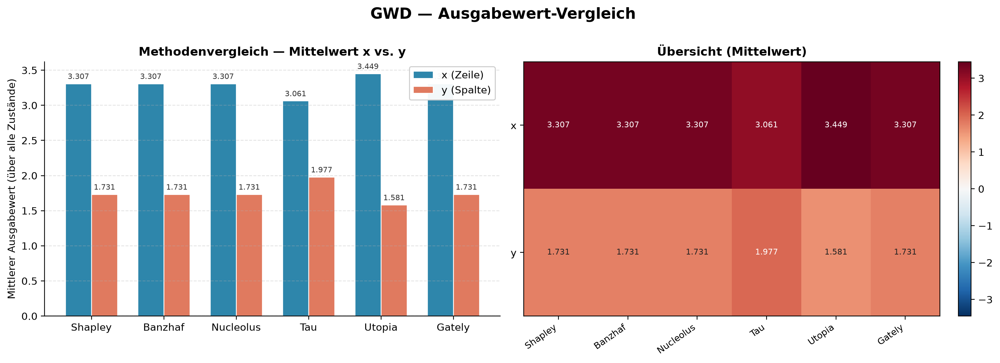

# Ausgabewert-Vergleich — gwa, gwb, gwc, gwd

Pro Spiel: Ausgabewerte berechnen und **innerhalb des Spiels** vergleichen.

## GWA

2×3 Grid, Ziel oben, 4 Zustände.

### Gesamtvergleich

| Feature | Shapley | Banzhaf | Nucleolus | Tau | Utopia | Gately |
|:-------:|--------:|--------:|--------:|--------:|--------:|--------:|
| x | 0.000 | 0.000 | 0.000 | 0.000 | 0.000 | 4.250 |
| y | 0.000 | 0.000 | 0.000 | 0.000 | 0.000 | 4.250 |

Detailtabelle (alle Zustände)

| Zustand | Feature | Shapley | Banzhaf | Nucleolus | Tau | Utopia | Gately |
|:--------|:-------:|--------:|--------:|--------:|--------:|--------:|--------:|
| `(0, 0)` | x | 0.000 | 0.000 | 0.000 | 0.000 | 0.000 | 4.000 |
| `(0, 0)` | y | 0.000 | 0.000 | 0.000 | 0.000 | 0.000 | 4.000 |
| `(0, 1)` | x | 0.000 | 0.000 | 0.000 | 0.000 | 0.000 | 4.500 |
| `(0, 1)` | y | 0.000 | 0.000 | 0.000 | 0.000 | 0.000 | 4.500 |
| `(1, 0)` | x | 0.000 | 0.000 | 0.000 | 0.000 | 0.000 | 4.000 |
| `(1, 0)` | y | 0.000 | 0.000 | 0.000 | 0.000 | 0.000 | 4.000 |
| `(1, 1)` | x | 0.000 | 0.000 | 0.000 | 0.000 | 0.000 | 4.500 |
| `(1, 1)` | y | 0.000 | 0.000 | 0.000 | 0.000 | 0.000 | 4.500 |

---

## GWB

2×4 Grid, Hindernis bei (0,1), 4 Zustände.

### Gesamtvergleich

| Feature | Shapley | Banzhaf | Nucleolus | Tau | Utopia | Gately |
|:-------:|--------:|--------:|--------:|--------:|--------:|--------:|
| x | 1.147 | 1.147 | 1.147 | 1.107 | 1.571 | 4.065 |
| y | 0.509 | 0.509 | 0.509 | 0.549 | 0.000 | 3.435 |

Detailtabelle (alle Zustände)

| Zustand | Feature | Shapley | Banzhaf | Nucleolus | Tau | Utopia | Gately |
|:--------|:-------:|--------:|--------:|--------:|--------:|--------:|--------:|
| `(0, 0)` | x | 4.088 | 4.088 | 4.088 | 4.088 | 6.114 | 4.010 |
| `(0, 0)` | y | 2.026 | 2.026 | 2.026 | 2.026 | 0.000 | 1.990 |
| `(1, 0)` | x | 0.329 | 0.329 | 0.329 | 0.169 | 0.169 | 3.752 |
| `(1, 0)` | y | -0.160 | -0.160 | -0.160 | 0.000 | 0.000 | 3.248 |
| `(1, 1)` | x | 0.090 | 0.090 | 0.090 | 0.090 | 0.000 | 4.000 |
| `(1, 1)` | y | 0.090 | 0.090 | 0.090 | 0.090 | 0.000 | 4.000 |
| `(1, 2)` | x | 0.082 | 0.082 | 0.082 | 0.082 | 0.000 | 4.500 |
| `(1, 2)` | y | 0.082 | 0.082 | 0.082 | 0.082 | 0.000 | 4.500 |

---

## GWC

2×4 Grid, zwei Hindernisse, 5 Zustände.

### Gesamtvergleich

| Feature | Shapley | Banzhaf | Nucleolus | Tau | Utopia | Gately |
|:-------:|--------:|--------:|--------:|--------:|--------:|--------:|
| x | 1.113 | 1.113 | 1.113 | 1.128 | 1.126 | 3.297 |
| y | 1.542 | 1.542 | 1.542 | 1.527 | 1.529 | 3.703 |

Detailtabelle (alle Zustände)

| Zustand | Feature | Shapley | Banzhaf | Nucleolus | Tau | Utopia | Gately |
|:--------|:-------:|--------:|--------:|--------:|--------:|--------:|--------:|
| `(0, 0)` | x | 3.927 | 3.927 | 3.927 | 3.927 | 3.920 | 2.518 |
| `(0, 0)` | y | 3.943 | 3.943 | 3.943 | 3.943 | 3.951 | 2.482 |
| `(1, 0)` | x | 0.163 | 0.163 | 0.163 | 0.218 | 0.279 | 2.742 |
| `(1, 0)` | y | 0.665 | 0.665 | 0.665 | 0.610 | 0.549 | 3.258 |
| `(1, 1)` | x | -0.005 | -0.005 | -0.005 | 0.000 | 0.000 | 3.255 |
| `(1, 1)` | y | 0.506 | 0.506 | 0.506 | 0.501 | 0.501 | 3.745 |
| `(1, 2)` | x | 1.171 | 1.171 | 1.171 | 1.171 | 1.107 | 3.457 |
| `(1, 2)` | y | 2.242 | 2.242 | 2.242 | 2.242 | 2.305 | 4.543 |
| `(0, 2)` | x | 0.311 | 0.311 | 0.311 | 0.326 | 0.326 | 4.514 |
| `(0, 2)` | y | 0.354 | 0.354 | 0.354 | 0.340 | 0.340 | 4.486 |

---

## GWD

10×10 Grid, 20 Blöcke.

### Gesamtvergleich

| Feature | Shapley | Banzhaf | Nucleolus | Tau | Utopia | Gately |
|:-------:|--------:|--------:|--------:|--------:|--------:|--------:|
| x | 3.307 | 3.307 | 3.307 | 3.061 | 3.449 | 6.035 |
| y | 1.731 | 1.731 | 1.731 | 1.977 | 1.581 | 4.459 |

Detailtabelle (alle Zustände)

| Zustand | Feature | Shapley | Banzhaf | Nucleolus | Tau | Utopia | Gately |
|:--------|:-------:|--------:|--------:|--------:|--------:|--------:|--------:|
| `(0, 2)` | x | 0.736 | 0.736 | 0.736 | 0.736 | 0.706 | 3.604 |
| `(0, 2)` | y | 0.527 | 0.527 | 0.527 | 0.527 | 0.556 | 3.396 |
| `(0, 4)` | x | 1.837 | 1.837 | 1.837 | 1.106 | 1.106 | 2.784 |
| `(0, 4)` | y | -0.731 | -0.731 | -0.731 | 0.000 | 0.000 | 0.216 |
| `(0, 5)` | x | 1.902 | 1.902 | 1.902 | 1.902 | 2.225 | 2.790 |
| `(0, 5)` | y | 0.323 | 0.323 | 0.323 | 0.323 | 0.000 | 1.210 |
| `(0, 6)` | x | 1.469 | 1.469 | 1.469 | 1.469 | 1.510 | 2.785 |
| `(0, 6)` | y | 0.898 | 0.898 | 0.898 | 0.898 | 0.857 | 2.214 |
| `(1, 0)` | x | 0.405 | 0.405 | 0.405 | 0.405 | 0.266 | 4.769 |
| `(1, 0)` | y | 0.868 | 0.868 | 0.868 | 0.868 | 1.007 | 5.232 |
| `(1, 1)` | x | -0.110 | -0.110 | -0.110 | 0.095 | 0.176 | 3.914 |
| `(1, 1)` | y | 1.062 | 1.062 | 1.062 | 0.858 | 0.777 | 5.086 |
| `(1, 2)` | x | 0.272 | 0.272 | 0.272 | 0.402 | 0.402 | 3.790 |
| `(1, 2)` | y | 0.693 | 0.693 | 0.693 | 0.563 | 0.563 | 4.210 |
| `(1, 4)` | x | 1.456 | 1.456 | 1.456 | 0.942 | 0.872 | 2.903 |
| `(1, 4)` | y | -0.350 | -0.350 | -0.350 | 0.164 | 0.234 | 1.097 |
| `(1, 5)` | x | 0.586 | 0.586 | 0.586 | 0.586 | 0.565 | 2.559 |
| `(1, 5)` | y | 0.468 | 0.468 | 0.468 | 0.468 | 0.489 | 2.441 |
| `(1, 6)` | x | 0.563 | 0.563 | 0.563 | 0.563 | 0.562 | 3.002 |
| `(1, 6)` | y | 0.558 | 0.558 | 0.558 | 0.558 | 0.559 | 2.998 |
| `(1, 7)` | x | 0.063 | 0.063 | 0.063 | 0.063 | 0.074 | 2.526 |
| `(1, 7)` | y | 0.011 | 0.011 | 0.011 | 0.011 | 0.000 | 2.474 |
| `(1, 8)` | x | 0.057 | 0.057 | 0.057 | 0.057 | 0.061 | 2.026 |
| `(1, 8)` | y | 0.004 | 0.004 | 0.004 | 0.004 | 0.000 | 1.974 |
| `(1, 9)` | x | 0.018 | 0.018 | 0.018 | 0.018 | 0.000 | 1.500 |
| `(1, 9)` | y | 0.018 | 0.018 | 0.018 | 0.018 | 0.000 | 1.500 |
| `(2, 0)` | x | 0.335 | 0.335 | 0.335 | 0.335 | 0.141 | 5.206 |
| `(2, 0)` | y | 0.923 | 0.923 | 0.923 | 0.923 | 1.117 | 5.794 |
| `(2, 3)` | x | 57.244 | 57.244 | 57.244 | 35.522 | 34.648 | 41.431 |
| `(2, 3)` | y | -21.617 | -21.617 | -21.617 | 0.105 | 0.978 | -37.431 |
| `(2, 4)` | x | 47.261 | 47.261 | 47.261 | 47.261 | 61.498 | 13.669 |
| `(2, 4)` | y | 24.923 | 24.923 | 24.923 | 24.923 | 10.686 | -8.669 |
| `(2, 5)` | x | 35.334 | 35.334 | 35.334 | 35.334 | 48.394 | 10.471 |
| `(2, 5)` | y | 20.392 | 20.392 | 20.392 | 20.392 | 7.333 | -4.471 |
| `(2, 6)` | x | 1.213 | 1.213 | 1.213 | 1.213 | 1.213 | 3.500 |
| `(2, 6)` | y | 1.212 | 1.212 | 1.212 | 1.212 | 1.212 | 3.500 |
| `(2, 7)` | x | -5.291 | -5.291 | -5.291 | 0.004 | 0.017 | -2.791 |
| `(2, 7)` | y | 6.290 | 6.290 | 6.290 | 0.995 | 0.982 | 8.791 |
| `(2, 8)` | x | -0.536 | -0.536 | -0.536 | 0.228 | 0.228 | 1.494 |
| `(2, 8)` | y | 1.476 | 1.476 | 1.476 | 0.711 | 0.711 | 3.506 |
| `(2, 9)` | x | -0.189 | -0.189 | -0.189 | 0.000 | 0.000 | 1.785 |
| `(2, 9)` | y | 0.240 | 0.240 | 0.240 | 0.051 | 0.051 | 2.215 |
| `(3, 0)` | x | 21.827 | 21.827 | 21.827 | 21.827 | 25.957 | 9.907 |
| `(3, 0)` | y | 14.013 | 14.013 | 14.013 | 14.013 | 9.882 | 2.093 |
| `(3, 1)` | x | 3.933 | 3.933 | 3.933 | 2.311 | 2.203 | 9.261 |
| `(3, 1)` | y | -1.588 | -1.588 | -1.588 | 0.033 | 0.141 | 3.739 |
| `(3, 2)` | x | -0.111 | -0.111 | -0.111 | 0.000 | 0.000 | 5.871 |
| `(3, 2)` | y | 0.147 | 0.147 | 0.147 | 0.036 | 0.036 | 6.129 |
| `(3, 4)` | x | 57.097 | 57.097 | 57.097 | 57.097 | 57.665 | 3.044 |
| `(3, 4)` | y | 55.009 | 55.009 | 55.009 | 55.009 | 54.442 | 0.956 |
| `(3, 6)` | x | 0.801 | 0.801 | 0.801 | 0.801 | 0.850 | 4.179 |
| `(3, 6)` | y | 0.442 | 0.442 | 0.442 | 0.442 | 0.392 | 3.821 |
| `(3, 9)` | x | 1.444 | 1.444 | 1.444 | 1.181 | 1.084 | 3.319 |
| `(3, 9)` | y | -0.195 | -0.195 | -0.195 | 0.068 | 0.165 | 1.681 |
| `(4, 1)` | x | 1.951 | 1.951 | 1.951 | 1.221 | 1.131 | 8.304 |
| `(4, 1)` | y | -0.658 | -0.658 | -0.658 | 0.072 | 0.162 | 5.696 |
| `(4, 2)` | x | 0.034 | 0.034 | 0.034 | 0.034 | 0.000 | 6.500 |
| `(4, 2)` | y | 0.034 | 0.034 | 0.034 | 0.034 | 0.000 | 6.500 |
| `(4, 3)` | x | 0.025 | 0.025 | 0.025 | 0.025 | 0.037 | 6.006 |
| `(4, 3)` | y | 0.012 | 0.012 | 0.012 | 0.012 | 0.000 | 5.993 |
| `(4, 5)` | x | 0.975 | 0.975 | 0.975 | 0.975 | 0.891 | 5.358 |
| `(4, 5)` | y | 0.259 | 0.259 | 0.259 | 0.259 | 0.343 | 4.642 |
| `(4, 6)` | x | 0.044 | 0.044 | 0.044 | 0.044 | 0.071 | 4.509 |
| `(4, 6)` | y | 0.027 | 0.027 | 0.027 | 0.027 | 0.000 | 4.491 |
| `(4, 7)` | x | 0.055 | 0.055 | 0.055 | 0.055 | 0.070 | 4.020 |
| `(4, 7)` | y | 0.015 | 0.015 | 0.015 | 0.015 | 0.000 | 3.980 |
| `(4, 8)` | x | 0.062 | 0.062 | 0.062 | 0.061 | 0.061 | 3.532 |
| `(4, 8)` | y | -0.002 | -0.002 | -0.002 | 0.000 | 0.000 | 3.468 |
| `(4, 9)` | x | 0.022 | 0.022 | 0.022 | 0.022 | 0.000 | 3.000 |
| `(4, 9)` | y | 0.022 | 0.022 | 0.022 | 0.022 | 0.000 | 3.000 |
| `(5, 0)` | x | 0.408 | 0.408 | 0.408 | 0.408 | 0.260 | 7.779 |
| `(5, 0)` | y | 0.850 | 0.850 | 0.850 | 0.850 | 0.997 | 8.221 |
| `(5, 1)` | x | 0.037 | 0.037 | 0.037 | 0.037 | 0.000 | 7.500 |
| `(5, 1)` | y | 0.037 | 0.037 | 0.037 | 0.037 | 0.000 | 7.500 |
| `(5, 2)` | x | 0.042 | 0.042 | 0.042 | 0.042 | 0.000 | 7.000 |
| `(5, 2)` | y | 0.042 | 0.042 | 0.042 | 0.042 | 0.000 | 7.000 |
| `(5, 3)` | x | 0.029 | 0.029 | 0.029 | 0.029 | 0.046 | 6.506 |
| `(5, 3)` | y | 0.017 | 0.017 | 0.017 | 0.017 | 0.000 | 6.494 |
| `(5, 5)` | x | 0.949 | 0.949 | 0.949 | 0.949 | 0.865 | 5.809 |
| `(5, 5)` | y | 0.332 | 0.332 | 0.332 | 0.332 | 0.416 | 5.191 |
| `(5, 6)` | x | 0.045 | 0.045 | 0.045 | 0.045 | 0.076 | 5.008 |
| `(5, 6)` | y | 0.030 | 0.030 | 0.030 | 0.030 | 0.000 | 4.992 |
| `(5, 7)` | x | -0.292 | -0.292 | -0.292 | 0.032 | 0.096 | 3.737 |
| `(5, 7)` | y | 1.234 | 1.234 | 1.234 | 0.910 | 0.847 | 5.263 |
| `(5, 8)` | x | 0.095 | 0.095 | 0.095 | 0.076 | 0.076 | 4.057 |
| `(5, 8)` | y | -0.019 | -0.019 | -0.019 | 0.000 | 0.000 | 3.943 |
| `(5, 9)` | x | 0.020 | 0.020 | 0.020 | 0.020 | 0.000 | 3.500 |
| `(5, 9)` | y | 0.020 | 0.020 | 0.020 | 0.020 | 0.000 | 3.500 |
| `(6, 0)` | x | 0.447 | 0.447 | 0.447 | 0.447 | 0.286 | 8.325 |
| `(6, 0)` | y | 0.798 | 0.798 | 0.798 | 0.798 | 0.959 | 8.675 |
| `(6, 1)` | x | 0.037 | 0.037 | 0.037 | 0.037 | 0.000 | 8.000 |
| `(6, 1)` | y | 0.037 | 0.037 | 0.037 | 0.037 | 0.000 | 8.000 |
| `(6, 2)` | x | 0.033 | 0.033 | 0.033 | 0.033 | 0.000 | 7.500 |
| `(6, 2)` | y | 0.033 | 0.033 | 0.033 | 0.033 | 0.000 | 7.500 |
| `(6, 3)` | x | 0.049 | 0.049 | 0.049 | 0.049 | 0.075 | 7.012 |
| `(6, 3)` | y | 0.026 | 0.026 | 0.026 | 0.026 | 0.000 | 6.988 |
| `(6, 4)` | x | 0.111 | 0.111 | 0.111 | 0.067 | 0.067 | 6.577 |
| `(6, 4)` | y | -0.044 | -0.044 | -0.044 | 0.000 | 0.000 | 6.423 |
| `(6, 5)` | x | 0.143 | 0.143 | 0.143 | 0.082 | 0.082 | 6.102 |
| `(6, 5)` | y | -0.061 | -0.061 | -0.061 | 0.000 | 0.000 | 5.898 |
| `(6, 6)` | x | 0.030 | 0.030 | 0.030 | 0.030 | 0.045 | 5.508 |
| `(6, 6)` | y | 0.015 | 0.015 | 0.015 | 0.015 | 0.000 | 5.492 |
| `(6, 8)` | x | 1.029 | 1.029 | 1.029 | 1.029 | 0.924 | 4.884 |
| `(6, 8)` | y | 0.261 | 0.261 | 0.261 | 0.261 | 0.365 | 4.116 |
| `(6, 9)` | x | 0.023 | 0.023 | 0.023 | 0.023 | 0.000 | 4.000 |
| `(6, 9)` | y | 0.023 | 0.023 | 0.023 | 0.023 | 0.000 | 4.000 |
| `(7, 0)` | x | 0.344 | 0.344 | 0.344 | 0.344 | 0.224 | 8.687 |
| `(7, 0)` | y | 0.969 | 0.969 | 0.969 | 0.969 | 1.089 | 9.313 |
| `(7, 1)` | x | 0.011 | 0.011 | 0.011 | 0.110 | 0.193 | 8.046 |
| `(7, 1)` | y | 0.919 | 0.919 | 0.919 | 0.819 | 0.736 | 8.954 |
| `(7, 2)` | x | 0.036 | 0.036 | 0.036 | 0.036 | 0.000 | 8.000 |
| `(7, 2)` | y | 0.036 | 0.036 | 0.036 | 0.036 | 0.000 | 8.000 |
| `(7, 3)` | x | 0.048 | 0.048 | 0.048 | 0.048 | 0.070 | 7.513 |
| `(7, 3)` | y | 0.021 | 0.021 | 0.021 | 0.021 | 0.000 | 7.487 |
| `(7, 4)` | x | 0.133 | 0.133 | 0.133 | 0.078 | 0.078 | 7.094 |
| `(7, 4)` | y | -0.055 | -0.055 | -0.055 | 0.000 | 0.000 | 6.906 |
| `(7, 5)` | x | 0.127 | 0.127 | 0.127 | 0.065 | 0.065 | 6.595 |
| `(7, 5)` | y | -0.062 | -0.062 | -0.062 | 0.000 | 0.000 | 6.405 |
| `(7, 6)` | x | 0.033 | 0.033 | 0.033 | 0.033 | 0.048 | 6.009 |
| `(7, 6)` | y | 0.014 | 0.014 | 0.014 | 0.014 | 0.000 | 5.991 |
| `(7, 8)` | x | 0.980 | 0.980 | 0.980 | 0.949 | 0.848 | 5.324 |
| `(7, 8)` | y | 0.331 | 0.331 | 0.331 | 0.363 | 0.463 | 4.676 |
| `(7, 9)` | x | 0.021 | 0.021 | 0.021 | 0.021 | 0.000 | 4.500 |
| `(7, 9)` | y | 0.021 | 0.021 | 0.021 | 0.021 | 0.000 | 4.500 |
| `(8, 0)` | x | -0.282 | -0.282 | -0.282 | 0.007 | 0.046 | 8.597 |
| `(8, 0)` | y | 1.525 | 1.525 | 1.525 | 1.236 | 1.196 | 10.403 |
| `(8, 2)` | x | 0.170 | 0.170 | 0.170 | 0.358 | 0.434 | 8.011 |
| `(8, 2)` | y | 1.147 | 1.147 | 1.147 | 0.958 | 0.883 | 8.989 |
| `(8, 3)` | x | 0.396 | 0.396 | 0.396 | 0.396 | 0.369 | 7.886 |
| `(8, 3)` | y | 0.625 | 0.625 | 0.625 | 0.625 | 0.653 | 8.114 |
| `(8, 4)` | x | 0.803 | 0.803 | 0.803 | 0.803 | 0.808 | 7.407 |
| `(8, 4)` | y | 0.989 | 0.989 | 0.989 | 0.989 | 0.984 | 7.593 |
| `(8, 5)` | x | 1.690 | 1.690 | 1.690 | 1.465 | 1.317 | 7.772 |
| `(8, 5)` | y | 0.147 | 0.147 | 0.147 | 0.371 | 0.520 | 6.228 |
| `(8, 6)` | x | 1.912 | 1.912 | 1.912 | 1.502 | 1.365 | 7.492 |
| `(8, 6)` | y | -0.072 | -0.072 | -0.072 | 0.338 | 0.475 | 5.508 |
| `(8, 7)` | x | 0.514 | 0.514 | 0.514 | 0.514 | 0.372 | 5.611 |
| `(8, 7)` | y | 1.291 | 1.291 | 1.291 | 1.291 | 1.433 | 6.389 |
| `(8, 8)` | x | 1.395 | 1.395 | 1.395 | 1.362 | 1.215 | 5.966 |
| `(8, 8)` | y | 0.463 | 0.463 | 0.463 | 0.495 | 0.643 | 5.034 |
| `(8, 9)` | x | 0.492 | 0.492 | 0.492 | 0.492 | 0.492 | 5.003 |
| `(8, 9)` | y | 0.486 | 0.486 | 0.486 | 0.486 | 0.487 | 4.997 |
| `(9, 1)` | x | 0.629 | 0.629 | 0.629 | 0.629 | 0.853 | 9.637 |
| `(9, 1)` | y | 0.355 | 0.355 | 0.355 | 0.355 | 0.131 | 9.363 |
| `(9, 2)` | x | 0.929 | 0.929 | 0.929 | 0.887 | 0.835 | 9.469 |
| `(9, 2)` | y | -0.008 | -0.008 | -0.008 | 0.034 | 0.086 | 8.531 |
| `(9, 4)` | x | 10.448 | 10.448 | 10.448 | 10.448 | 10.635 | 3.214 |
| `(9, 4)` | y | 18.020 | 18.020 | 18.020 | 18.020 | 17.833 | 10.786 |
| `(9, 5)` | x | 1.069 | 1.069 | 1.069 | 0.899 | 0.899 | 7.120 |
| `(9, 5)` | y | -0.170 | -0.170 | -0.170 | 0.000 | 0.000 | 5.880 |
| `(9, 6)` | x | 1.232 | 1.232 | 1.232 | 0.940 | 0.940 | 6.762 |
| `(9, 6)` | y | -0.292 | -0.292 | -0.292 | 0.000 | 0.000 | 5.238 |
| `(9, 7)` | x | 0.512 | 0.512 | 0.512 | 0.512 | 0.919 | 5.552 |
| `(9, 7)` | y | 0.407 | 0.407 | 0.407 | 0.407 | 0.000 | 5.448 |
| `(9, 8)` | x | 0.879 | 0.879 | 0.879 | 0.879 | 0.964 | 5.397 |
| `(9, 8)` | y | 0.085 | 0.085 | 0.085 | 0.085 | 0.000 | 4.603 |
| `(9, 9)` | x | 0.713 | 0.713 | 0.713 | 0.713 | 0.907 | 4.760 |
| `(9, 9)` | y | 0.194 | 0.194 | 0.194 | 0.194 | 0.000 | 4.240 |

---

