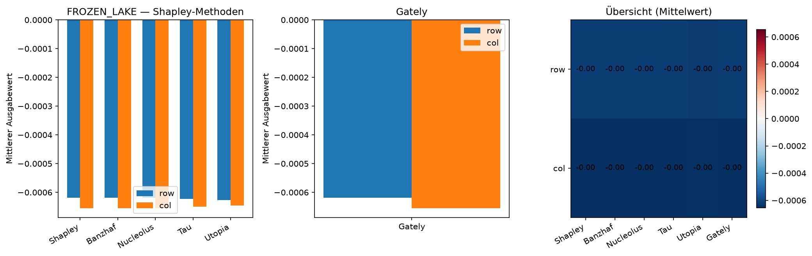

# FROZEN LAKE — Ausgabewert-Vergleich

Gym **FrozenLake-v1** (4×4, slippery). Features: **row**, **col**.

Value Iteration (γ=0.99) | Charakteristik: **local_sverl** | Rolls: 5,000

**Erklärte Zustände:** 11 (nicht-terminal)

## Gesamtvergleich (Mittel über alle Zustände)

| Feature | Shapley | Banzhaf | Nucleolus | Tau | Utopia | Gately |
|:-------:|--------:|--------:|--------:|--------:|--------:|--------:|
| row | -0.001 | -0.001 | -0.001 | -0.001 | -0.001 | -0.001 |
| col | -0.001 | -0.001 | -0.001 | -0.001 | -0.001 | -0.001 |

## Detailtabelle (pro Zustand)

| Zustand | Feature | Shapley | Banzhaf | Nucleolus | Tau | Utopia | Gately |
|:--------|:-------:|--------:|--------:|--------:|--------:|--------:|--------:|
| `(0, 0)` | row | 0.000 | 0.000 | 0.000 | 0.000 | 0.000 | 0.000 |
| `(0, 0)` | col | 0.000 | 0.000 | 0.000 | 0.000 | 0.000 | 0.000 |
| `(0, 1)` | row | 0.000 | 0.000 | 0.000 | 0.000 | 0.000 | 0.000 |
| `(0, 1)` | col | 0.000 | 0.000 | 0.000 | 0.000 | 0.000 | 0.000 |
| `(0, 2)` | row | 0.000 | 0.000 | 0.000 | 0.000 | 0.000 | 0.000 |
| `(0, 2)` | col | 0.000 | 0.000 | 0.000 | 0.000 | 0.000 | 0.000 |
| `(0, 3)` | row | 0.000 | 0.000 | 0.000 | 0.000 | 0.000 | 0.000 |
| `(0, 3)` | col | 0.000 | 0.000 | 0.000 | 0.000 | 0.000 | 0.000 |
| `(1, 0)` | row | 0.000 | 0.000 | 0.000 | 0.000 | 0.000 | 0.000 |
| `(1, 0)` | col | 0.000 | 0.000 | 0.000 | 0.000 | 0.000 | 0.000 |
| `(1, 2)` | row | 0.000 | 0.000 | 0.000 | 0.000 | 0.000 | 0.000 |
| `(1, 2)` | col | 0.000 | 0.000 | 0.000 | 0.000 | 0.000 | 0.000 |
| `(2, 0)` | row | 0.000 | 0.000 | 0.000 | 0.000 | 0.000 | 0.000 |
| `(2, 0)` | col | 0.000 | 0.000 | 0.000 | 0.000 | 0.000 | 0.000 |
| `(2, 1)` | row | 0.000 | 0.000 | 0.000 | 0.000 | 0.000 | 0.000 |
| `(2, 1)` | col | 0.000 | 0.000 | 0.000 | 0.000 | 0.000 | 0.000 |
| `(2, 2)` | row | 0.000 | 0.000 | 0.000 | 0.000 | 0.000 | 0.000 |
| `(2, 2)` | col | 0.000 | 0.000 | 0.000 | 0.000 | 0.000 | 0.000 |
| `(3, 1)` | row | 0.000 | 0.000 | 0.000 | 0.000 | 0.000 | 0.000 |
| `(3, 1)` | col | 0.000 | 0.000 | 0.000 | 0.000 | 0.000 | 0.000 |
| `(3, 2)` | row | -0.007 | -0.007 | -0.007 | -0.007 | -0.007 | -0.007 |
| `(3, 2)` | col | -0.007 | -0.007 | -0.007 | -0.007 | -0.007 | -0.007 |

