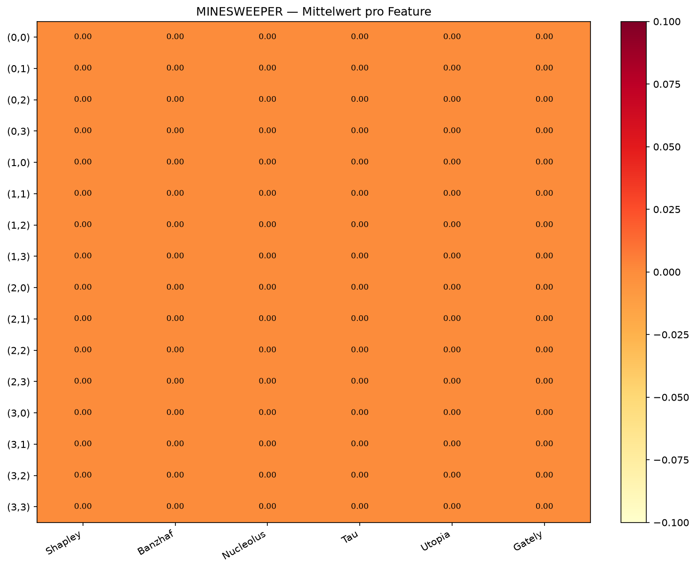

# MINESWEEPER — Ausgabewert-Vergleich

4×4-Brett, 2 Minen. **16 Features** = Felder (0,0) … (3,3).

Charakteristik: **fast_local_sverl** | Train: 3,000,000 | Rolls/Zustand-Aktion: 1,000

**Erklärte Zustände (Brett, -1=unaufgedeckt, 2=Mine aufgedeckt):**

**Zustand 1** — Feld (3,2) noch unaufgedeckt

```
 0  0  1 -1
 0  1  2 -1
 0  1 -1 -1
 0  1  1  1
```

**Zustand 2** — Feld (3,2) als Mine aufgedeckt (Spiel verloren)

```
 0  0  1 -1
 0  1  2 -1
 0  1 -1  2
 0  1  1  1
```





## Gesamtvergleich (Mittel über beide Zustände)

| Feature | Shapley | Banzhaf | Nucleolus | Tau | Utopia | Gately |
|:-------:|--------:|--------:|--------:|--------:|--------:|--------:|
| (0,0) | — | — | — | — | — | — |
| (0,1) | — | — | — | — | — | — |
| (0,2) | — | — | — | — | — | — |
| (0,3) | — | — | — | — | — | — |
| (1,0) | — | — | — | — | — | — |
| (1,1) | — | — | — | — | — | — |
| (1,2) | — | — | — | — | — | — |
| (1,3) | — | — | — | — | — | — |
| (2,0) | — | — | — | — | — | — |
| (2,1) | — | — | — | — | — | — |
| (2,2) | — | — | — | — | — | — |
| (2,3) | — | — | — | — | — | — |
| (3,0) | — | — | — | — | — | — |
| (3,1) | — | — | — | — | — | — |
| (3,2) | — | — | — | — | — | — |
| (3,3) | — | — | — | — | — | — |

## Detailtabelle (pro Zustand)

| Zustand | Feature | Shapley | Banzhaf | Nucleolus | Tau | Utopia | Gately |
|:--------|:-------:|--------:|--------:|--------:|--------:|--------:|--------:|
| `(0, 0, 1, -1, 0, 1, 2, -1, 0, 1, -1, -1, 0, 1, 1, 1)` | (0,0) | — | — | — | — | — | — |
| `(0, 0, 1, -1, 0, 1, 2, -1, 0, 1, -1, -1, 0, 1, 1, 1)` | (0,1) | — | — | — | — | — | — |
| `(0, 0, 1, -1, 0, 1, 2, -1, 0, 1, -1, -1, 0, 1, 1, 1)` | (0,2) | — | — | — | — | — | — |
| `(0, 0, 1, -1, 0, 1, 2, -1, 0, 1, -1, -1, 0, 1, 1, 1)` | (0,3) | — | — | — | — | — | — |
| `(0, 0, 1, -1, 0, 1, 2, -1, 0, 1, -1, -1, 0, 1, 1, 1)` | (1,0) | — | — | — | — | — | — |
| `(0, 0, 1, -1, 0, 1, 2, -1, 0, 1, -1, -1, 0, 1, 1, 1)` | (1,1) | — | — | — | — | — | — |
| `(0, 0, 1, -1, 0, 1, 2, -1, 0, 1, -1, -1, 0, 1, 1, 1)` | (1,2) | — | — | — | — | — | — |
| `(0, 0, 1, -1, 0, 1, 2, -1, 0, 1, -1, -1, 0, 1, 1, 1)` | (1,3) | — | — | — | — | — | — |
| `(0, 0, 1, -1, 0, 1, 2, -1, 0, 1, -1, -1, 0, 1, 1, 1)` | (2,0) | — | — | — | — | — | — |
| `(0, 0, 1, -1, 0, 1, 2, -1, 0, 1, -1, -1, 0, 1, 1, 1)` | (2,1) | — | — | — | — | — | — |
| `(0, 0, 1, -1, 0, 1, 2, -1, 0, 1, -1, -1, 0, 1, 1, 1)` | (2,2) | — | — | — | — | — | — |
| `(0, 0, 1, -1, 0, 1, 2, -1, 0, 1, -1, -1, 0, 1, 1, 1)` | (2,3) | — | — | — | — | — | — |
| `(0, 0, 1, -1, 0, 1, 2, -1, 0, 1, -1, -1, 0, 1, 1, 1)` | (3,0) | — | — | — | — | — | — |
| `(0, 0, 1, -1, 0, 1, 2, -1, 0, 1, -1, -1, 0, 1, 1, 1)` | (3,1) | — | — | — | — | — | — |
| `(0, 0, 1, -1, 0, 1, 2, -1, 0, 1, -1, -1, 0, 1, 1, 1)` | (3,2) | — | — | — | — | — | — |
| `(0, 0, 1, -1, 0, 1, 2, -1, 0, 1, -1, -1, 0, 1, 1, 1)` | (3,3) | — | — | — | — | — | — |
| `(0, 0, 1, -1, 0, 1, 2, -1, 0, 1, -1, 2, 0, 1, 1, 1)` | (0,0) | — | — | — | — | — | — |
| `(0, 0, 1, -1, 0, 1, 2, -1, 0, 1, -1, 2, 0, 1, 1, 1)` | (0,1) | — | — | — | — | — | — |
| `(0, 0, 1, -1, 0, 1, 2, -1, 0, 1, -1, 2, 0, 1, 1, 1)` | (0,2) | — | — | — | — | — | — |
| `(0, 0, 1, -1, 0, 1, 2, -1, 0, 1, -1, 2, 0, 1, 1, 1)` | (0,3) | — | — | — | — | — | — |
| `(0, 0, 1, -1, 0, 1, 2, -1, 0, 1, -1, 2, 0, 1, 1, 1)` | (1,0) | — | — | — | — | — | — |
| `(0, 0, 1, -1, 0, 1, 2, -1, 0, 1, -1, 2, 0, 1, 1, 1)` | (1,1) | — | — | — | — | — | — |
| `(0, 0, 1, -1, 0, 1, 2, -1, 0, 1, -1, 2, 0, 1, 1, 1)` | (1,2) | — | — | — | — | — | — |
| `(0, 0, 1, -1, 0, 1, 2, -1, 0, 1, -1, 2, 0, 1, 1, 1)` | (1,3) | — | — | — | — | — | — |
| `(0, 0, 1, -1, 0, 1, 2, -1, 0, 1, -1, 2, 0, 1, 1, 1)` | (2,0) | — | — | — | — | — | — |
| `(0, 0, 1, -1, 0, 1, 2, -1, 0, 1, -1, 2, 0, 1, 1, 1)` | (2,1) | — | — | — | — | — | — |
| `(0, 0, 1, -1, 0, 1, 2, -1, 0, 1, -1, 2, 0, 1, 1, 1)` | (2,2) | — | — | — | — | — | — |
| `(0, 0, 1, -1, 0, 1, 2, -1, 0, 1, -1, 2, 0, 1, 1, 1)` | (2,3) | — | — | — | — | — | — |
| `(0, 0, 1, -1, 0, 1, 2, -1, 0, 1, -1, 2, 0, 1, 1, 1)` | (3,0) | — | — | — | — | — | — |
| `(0, 0, 1, -1, 0, 1, 2, -1, 0, 1, -1, 2, 0, 1, 1, 1)` | (3,1) | — | — | — | — | — | — |
| `(0, 0, 1, -1, 0, 1, 2, -1, 0, 1, -1, 2, 0, 1, 1, 1)` | (3,2) | — | — | — | — | — | — |
| `(0, 0, 1, -1, 0, 1, 2, -1, 0, 1, -1, 2, 0, 1, 1, 1)` | (3,3) | — | — | — | — | — | — |
