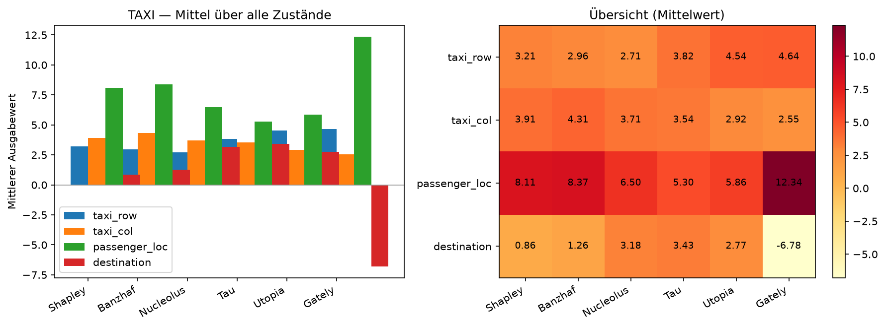

# TAXI — Ausgabewert-Vergleich

Gymnasium **Taxi-v3** (faktorisierter Zustand). **4 Features**: taxi_row, taxi_col, passenger_loc, destination.

Value Iteration (γ=0.99) | Charakteristik: **local_sverl** | Rolls: 300

**Erklärte Zustände:**

- `(0, 0, 0, 1)` — Vor Abholung (an R)
- `(0, 0, 4, 1)` — Nach Abholung (an R, Passagier im Taxi)
- `(0, 4, 4, 1)` — Vor Absetzen (an G, Passagier im Taxi)
- `(2, 2, 2, 3)` — Generische Navigation (Mitte des Gitters)

## Gesamtvergleich (Mittel über alle vier Zustände)

| Feature | Shapley | Banzhaf | Nucleolus | Tau | Utopia | Gately |
|:-------:|--------:|--------:|--------:|--------:|--------:|--------:|
| taxi_row | 3.212 | 2.957 | 2.709 | 3.819 | 4.540 | 4.640 |
| taxi_col | 3.909 | 4.312 | 3.709 | 3.543 | 2.924 | 2.551 |
| passenger_loc | 8.111 | 8.373 | 6.495 | 5.297 | 5.858 | 12.342 |
| destination | 0.861 | 1.255 | 3.180 | 3.433 | 2.771 | -6.784 |

## Detailtabelle (pro Zustand)

| Zustand | Feature | Shapley | Banzhaf | Nucleolus | Tau | Utopia | Gately |
|:--------|:-------:|--------:|--------:|--------:|--------:|--------:|--------:|
| `(0, 0, 0, 1)` | taxi_row | 4.394 | 3.526 | 5.367 | 6.788 | 8.372 | 2.732 |
| `(0, 0, 0, 1)` | taxi_col | 7.056 | 8.757 | 9.338 | 6.008 | 3.655 | 2.931 |
| `(0, 0, 0, 1)` | passenger_loc | 14.499 | 15.992 | 11.512 | 7.648 | 13.854 | 1.147 |
| `(0, 0, 0, 1)` | destination | -0.069 | 0.050 | -0.337 | 5.435 | 0.000 | 4.191 |
| `(0, 0, 4, 1)` | taxi_row | -1.575 | -1.876 | -0.393 | 0.058 | 0.171 | 0.126 |
| `(0, 0, 4, 1)` | taxi_col | -0.576 | -1.253 | 0.410 | 0.130 | 0.385 | 0.829 |
| `(0, 0, 4, 1)` | passenger_loc | 4.945 | 4.352 | 2.530 | 2.718 | 2.434 | 10.148 |
| `(0, 0, 4, 1)` | destination | 0.605 | 0.381 | 0.853 | 0.494 | 0.410 | 0.898 |
| `(0, 4, 4, 1)` | taxi_row | 7.064 | 7.340 | 2.638 | 6.967 | 8.594 | 13.532 |
| `(0, 4, 4, 1)` | taxi_col | 6.458 | 7.244 | 1.910 | 6.617 | 6.694 | 4.376 |
| `(0, 4, 4, 1)` | passenger_loc | 8.975 | 9.399 | 9.653 | 5.463 | 0.434 | 33.565 |
| `(0, 4, 4, 1)` | destination | 3.899 | 5.688 | 12.195 | 7.350 | 10.674 | -31.472 |
| `(2, 2, 2, 3)` | taxi_row | 2.966 | 2.837 | 3.223 | 1.465 | 1.023 | 2.171 |
| `(2, 2, 2, 3)` | taxi_col | 2.697 | 2.498 | 3.177 | 1.418 | 0.961 | 2.069 |
| `(2, 2, 2, 3)` | passenger_loc | 4.024 | 3.750 | 2.287 | 5.359 | 6.710 | 4.511 |
| `(2, 2, 2, 3)` | destination | -0.993 | -1.098 | 0.007 | 0.451 | 0.000 | -0.751 |
