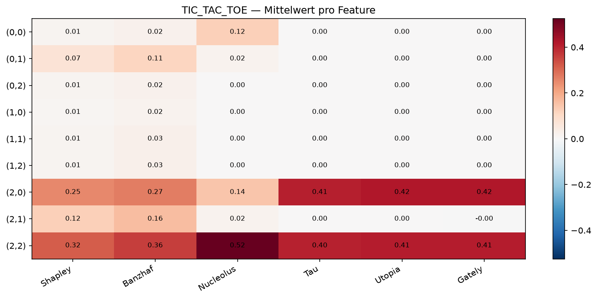

# TIC-TAC-TOE — Ausgabewert-Vergleich


```
0 0 0
0 1 0
2 0 2
```
(0=leer, 1=Agent, 2=Gegner)

## Gesamtvergleich (pro Feld)

| Feature | Shapley | Banzhaf | Nucleolus | Tau | Utopia | Gately |
|:-------:|--------:|--------:|--------:|--------:|--------:|--------:|
| (0,0)   | 0.009   | 0.017   | 0.000 | 0.007 | 0.000 | -0.082 |
| (0,1)   | 0.072   | 0.112   | 0.138 | 0.007 | 0.000 | -0.082 |
| (0,2)   | 0.005   | 0.011   | 0.000 | 0.007 | 0.000 | -0.082 |
| (1,0)   | 0.005   | 0.014   | 0.000 | 0.007 | 0.000 | -0.082 |
| (1,1)   | 0.039   | 0.064   | 0.009 | 0.007 | 0.000 | -0.079 |
| (1,2)   | 0.007   | 0.016   | 0.009 | 0.007 | 0.000 | -0.082 |
| (2,0)   | 0.287   | 0.318   | 0.144 | 0.393 | 0.419 | 0.281 |
| (2,1)   | 0.115   | 0.150   | 0.042 | 0.007 | 0.000 | -0.069 |
| (2,2)   | 0.295   | 0.329   | 0.492 | 0.389 | 0.415 | 0.277 |




## Detailtabelle

| Zustand | Feature | Shapley | Banzhaf | Nucleolus | Tau | Utopia | Gately |
|:--------|:-------:|--------:|--------:|--------:|--------:|--------:|--------:|
| `(0, 0, 0, 0, 1, 0, 2, 0, 2)` | (0,0) | 0.009 | 0.017 | 0.000 | 0.007 | 0.000 | -0.082 |
| `(0, 0, 0, 0, 1, 0, 2, 0, 2)` | (0,1) | 0.072 | 0.112 | 0.138 | 0.007 | 0.000 | -0.082 |
| `(0, 0, 0, 0, 1, 0, 2, 0, 2)` | (0,2) | 0.005 | 0.011 | 0.000 | 0.007 | 0.000 | -0.082 |
| `(0, 0, 0, 0, 1, 0, 2, 0, 2)` | (1,0) | 0.005 | 0.014 | 0.000 | 0.007 | 0.000 | -0.082 |
| `(0, 0, 0, 0, 1, 0, 2, 0, 2)` | (1,1) | 0.039 | 0.064 | 0.009 | 0.007 | 0.000 | -0.079 |
| `(0, 0, 0, 0, 1, 0, 2, 0, 2)` | (1,2) | 0.007 | 0.016 | 0.009 | 0.007 | 0.000 | -0.082 |
| `(0, 0, 0, 0, 1, 0, 2, 0, 2)` | (2,0) | 0.287 | 0.318 | 0.144 | 0.393 | 0.419 | 0.281 |
| `(0, 0, 0, 0, 1, 0, 2, 0, 2)` | (2,1) | 0.115 | 0.150 | 0.042 | 0.007 | 0.000 | -0.069 |
| `(0, 0, 0, 0, 1, 0, 2, 0, 2)` | (2,2) | 0.295 | 0.329 | 0.492 | 0.389 | 0.415 | 0.277 |
